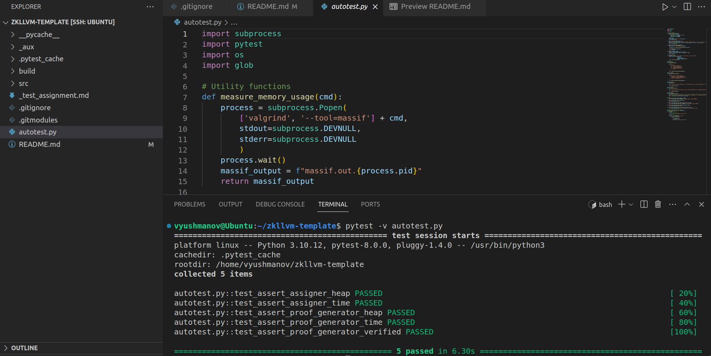

# Autotests for =Nil zkLLVM toolchain

Code is available in the [autotest.py](./autotest.py) Python script.

## Prerequisites

Install `pytest`:

```shell
pip install pytest
```

## Running the tests

1. Clone the repository 
2. Make sure `assigner` and `proof generator` are compiled and installed, and the circuit is compiled based on the modified files in [src](./src) directory
3. From the root of the repository run:
```shell
pytest -v autotest.py
```

### Sample of a successful test run:



### Comments

* Reference values for assertions (peak heap size and time) are taken empirically from running the `valgrind` and `time` commands manually, and rounded to compensate for fluctuations
* The following tests are executed:
    * Asserting that `assigner` peak heap usage is below `483000000 Bytes`
    * Asserting that `assigner` execution time is below `220 ms`
    * Asserting that `proof-generator` peak heap usage is below `1180000 Bytes`
    * Asserting that `proof-generator` execution time is below `260 ms`
    * Asserting that `proof-generator` verifies succesfully (locating "`Proof is verified`" in the output)
